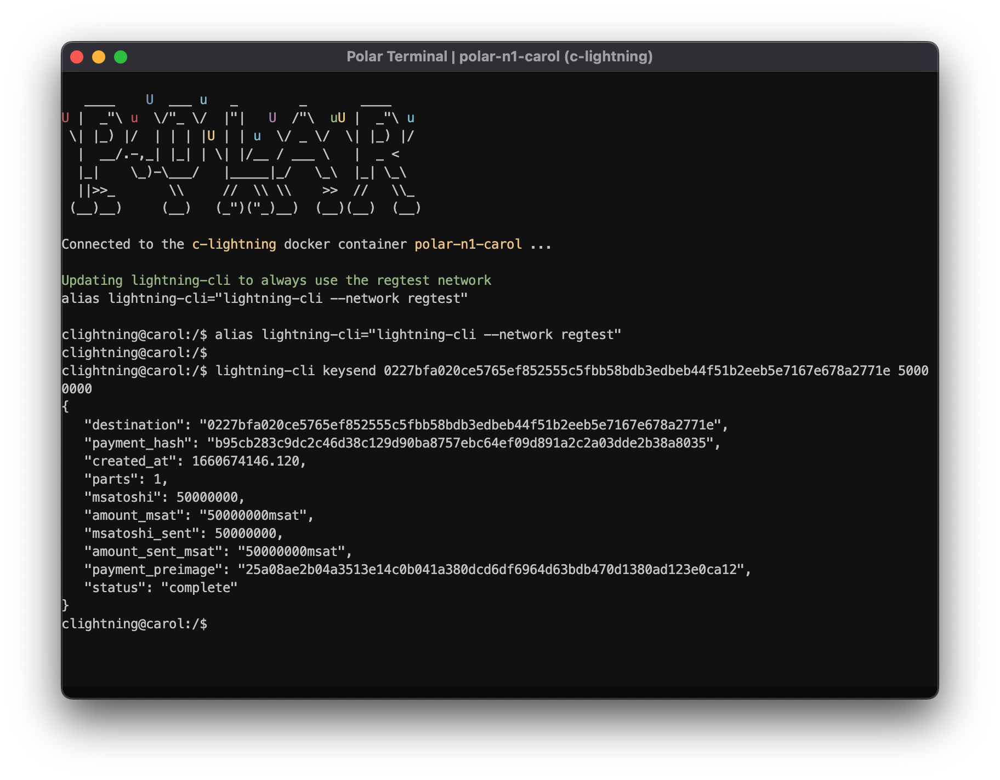
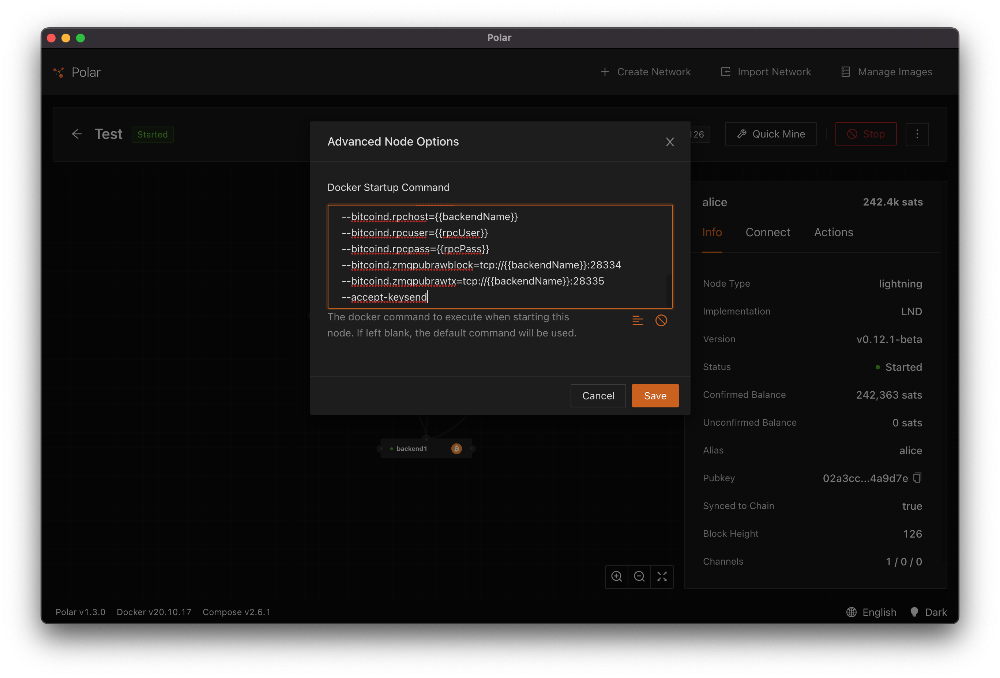
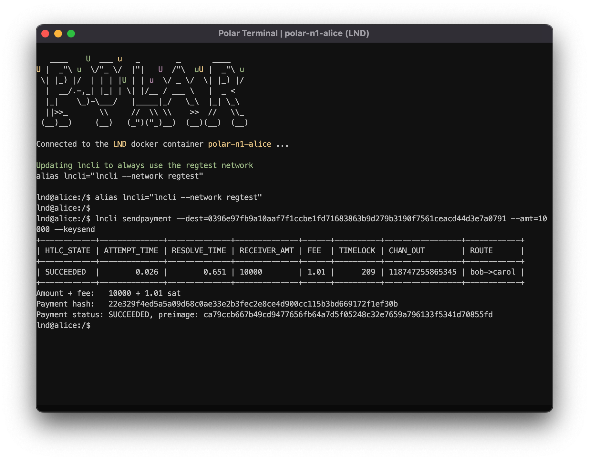

# Spontaneous Payments with Keysend

Spontaneous payments are a type of payment that doesn't require the recipient to generate an invoice. This type of payment is payment is initiated by the sender and the recipient may or may not be expecting the payment.

Spontaneous payments are useful for a variety of scenarios:

- Partial refunds - a merchant can issue a refund for an item they are unable to fulfill.
- Tipping - a spontaneous payment can be be made to give someone some balance

The major downside to spontaneous payments is that you lose proof of payment for a specific invoice since the preimage is generated by the payment sender.

# Keysend

Keysend is defined in [BLIP 0003](https://github.com/lightning/blips/blob/master/blip-0003.md). It is an optional feature of Lightning Network nodes that enables spontaneous payments.

This feature relies on upon [variable length onion packets](https://github.com/lightning/bolts/blob/bc86304b4b0af5fd5ce9d24f74e2ebbceb7e2730/04-onion-routing.md#tlv_payload-format). It works by encoding the preimage into onion data that is decrypted by the payment recipient in the last hop of the onion.

In order to make a keysend payment requires:

- generating a unique 32-byte preimage
- create a sha256 hash of the preimage
- set a custom onion record with identifier 5482373484 to the preimage

A receiving node that has keysend enabled will understand the custom onion record. It will then create an invoice on the fly and resolve it using the value supplied by the sender.

## Keysend on C-Lightning

Keysend is enabled by default on C-Lightning. Keysend payments can be sent using the [`keysend` CLI command](https://lightning.readthedocs.io/lightning-keysend.7.html)

For example if Carol is running a C-Lightning node and wants to send payment 50,000 satoshis to Bob who has a node identifier of 0227bfa020ce5765ef852555c5fbb58bdb3edbeb44f51b2eeb5e7167e678a2771e. She would use the command

```
lightning-cli keysend 0227bfa020ce5765ef852555c5fbb58bdb3edbeb44f51b2eeb5e7167e678a2771e 50000000
```



## Keysend on LND

Keysend is an optional feature on LND. To enable this feature requires starting your LND using the `--accept-keysend` flag.

You can do this in Polar by right-clicking an LND node and selecting `Advanced Options`. Under advanced options, click the "Pre-fill with the default command" button, then add the `--accept-keysend` flag.



Restart your node.

You can then open a terminal and send payments using the `sendpayment` CLI command by providing a destination `--dest=<nod_id>`, amount in satoshis `--amt=<value>` and the flag `--keysend`

For example to send 10,000 satoshi's to Carol's node that has the node identifier 0396e97fb9a10aaf7f1ccbe1fd71683863b9d279b3190f7561ceacd44d3e7a0791:

```
lncli sendpayment --dest=0396e97fb9a10aaf7f1ccbe1fd71683863b9d279b3190f7561ceacd44d3e7a0791 --amt=10000 --keysend
```



## Exercise: Try Keysend from Code

Now we can try performing a keysend from code. Using your LND node that has keysend enabled you can run the script and supply the destination node identifier and the amount in satoshis. This script relies on the [`SendPaymentV2`](https://api.lightning.community/#sendpaymentv2) API of LND and supplies the custom onion record with the payment preimage.

```
npm run start exercises/spontaneous-keysend/Run.ts <dest_node_id> <amt>
```

The script will run the following code located in `exercises/spontaneous-keysend/Run.ts`.

```typescript
async function run(): Promise<void> {
  // Obtains destination and amount from command line
  const dest = Buffer.from(process.argv[2], "hex");
  const amt = process.argv[3];

  // Generates a preimage and a hash
  const secret = crypto.randomBytes(32);
  const hash = sha256(secret);

  console.log("Dest    ", dest.toString("hex"));
  console.log("Amt     ", amt);
  console.log("Preimage", secret.toString("hex"));
  console.log("Hash    ", hash.toString("hex"));

  // Constructs a LND client from the environment variables
  const client = await ClientFactory.lndFromEnv();

  // Initiate spontaneous using keysend
  await client.sendPaymentV2(
    {
      dest,
      amt,
      payment_hash: hash,
      dest_custom_records: { 5482373484: secret },
      timeout_seconds: 60,
    },
    (payment: Lnd.Payment) => {
      console.log(util.inspect(payment, false, 6, true));
    }
  );
}
```

This script will do the following:

- Read the destination and amount from the command line
- Create a random 32-byte preimage
- Create a sha256 hash of the preimage
- Construct an LND client from our environment variables as we've done before
- Use the payment using `sendPaymentv2` and enabling keysend by including a custom onion record type=5482373484 and the value being the preimage.

When it completes successfully you should see a payment status with the `status=SUCCEEDED` output to the console.
