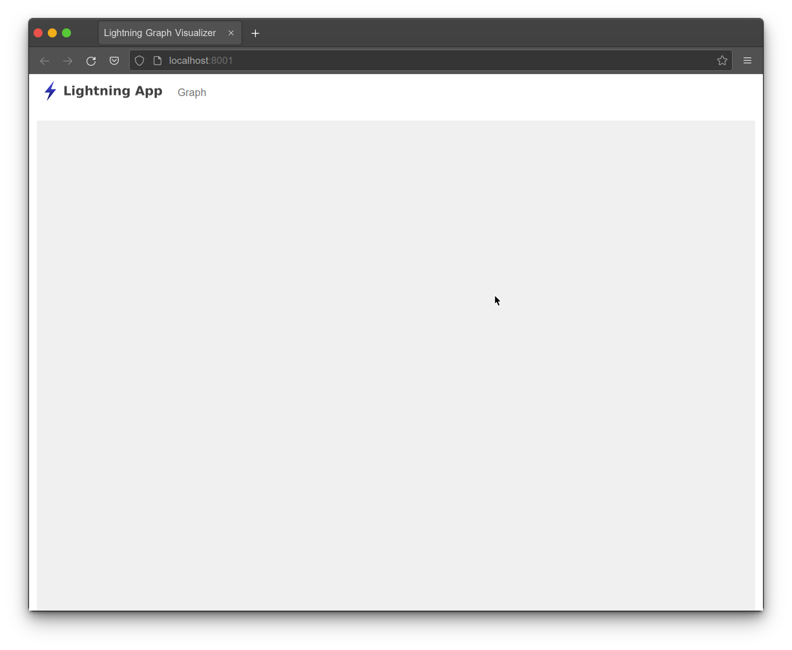
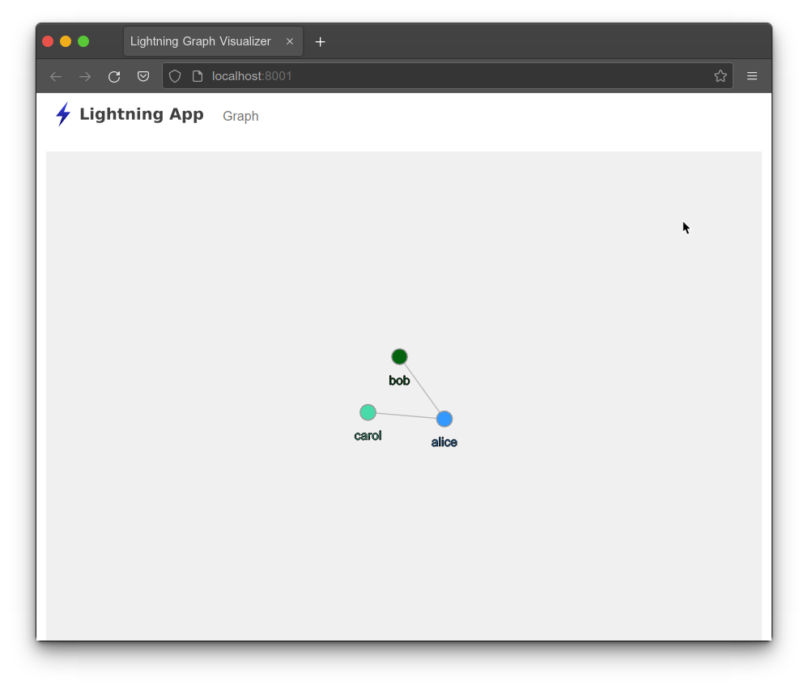

# User Interface

Now that we have a functioning server, let's jump into the user interface! This application uses the React.js framework and D3.js. If you're not familiar with React, I suggest finding a tutorial to get familiar with the concepts and basic mechanics. We'll again be using TypeScript for our React code to help us add compile-time type-checking.

## Exploring the User Interface

The user interface sub-project lives inside the `client` folder of our repository. Inside `client/src` is our application code.

The entry point of the application is `App.tsx`. This code uses `react-router` to allow us to link URLs to various scenes of our application. Once we've built-up our entry point we embed the application into the DOM.

```typescript
// client/src/App

import React from "react";
import ReactDom from "react-dom";
import { BrowserRouter } from "react-router-dom";
import { LayoutScene } from "./scenes/layout/LayoutScene";

ReactDom.render(
  <BrowserRouter>
    <LayoutScene />
  </BrowserRouter>,
  document.getElementById("app")
);
```

From this you will see that we render a single component, `<LayoutScene>`. It lives inside `client/src/scenes/layout`. Inside this folder is where we define things related to our application layout.

The `LayoutScene` component is also where we use `react-router` to define our various scenes based on the URL path.

```typescript
// client/src/scenes/layout/LayoutScene

import React from "react";
import { Route, Routes } from "react-router-dom";
import { AppNav } from "./components/AppNav";
import { GraphScene } from "../graph/GraphScene";

export const LayoutScene = () => {
  return (
    <div className="layout">
      <div className="container-fluid mb-3">
        <AppNav />
      </div>
      <Routes>
        <Route path="/" element={<GraphScene />} />
      </Routes>
    </div>
  );
};
```

Here you can see that inside the `<Routes>` component we define a single `<Route>` that is bound to the root path `/`. This route renders the `GraphScene` component which renders our graph!

So our folder structure looks like this:

```
client\
  src\
    App.tsx
    scenes\
      layout\
        LayoutScene.tsx
      graph\
        GraphScene.tsx
```

And our code component hierarchy looks like this:

```
App
  LayoutScene
    GraphScene
```

Each of the scenes can also have components that are specific to the the scene. These are stored inside the `components` folder inside each scene.

```
client\
  src\
    App.tsx
    scenes\
      layout\
        LayoutScene.tsx
        components\
          NavBar.tsx
      graph\
        GraphScene.tsx
        components\
          Graph.tsx
```

Because we're already ran `npm run watch` at the root of the application, our client side code is already being built for us.

This command builds the React application and place it into the `dist` folder.

You can now use your browser to navigate to [http://localhost:8001](http://localhost:8001) and view the application!


## Exercise: Loading the Graph

Our next task is wiring up the graph API we previously created to our user interface. To make our life easier we will use an `ApiService` to house the calls to our API.

In your IDE, navigate to `/client/src/services/ApiService.ts` and create a method that uses the get helper `get` to retrieve the graph.

```typescript
// client/src/services/ApiService

import { Lnd } from "./ApiTypes";

export class ApiService {
  constructor(readonly host: string = "http://127.0.0.1:8001") {}

  protected async get<T>(path: string): Promise<T> {
    const res = await fetch(path, { credentials: "include" });
    return await res.json();
  }

  // Exercise: Create a public fetchGraph method that returns Promise<Lnd.Graph>.
  // You can use the get helper method above by supplying it with the path /api/graph.
  public async fetchGraph(): Promise<Lnd.Graph> {
    return undefined;
  }
}
```

This class is conveniently accessible by using the `useApi` hook located in the `hooks` folder. By adding our `fetchGraph` method to the `ApiService`, we can gain access to it with the `useApi` hook inside any component! Feel free to take a look at the `useApi` hook code and if you're confused read up on React hooks.

## Exercise: Wire up the API Call

Next let's point our IDE at the `GraphScene` component in `client/src/scenes/graph` and see if we can wire up the API to a component.

For this exercise, inside the `useEffect` hook, call the api's `fetchGraph` method. Be mindful that this method returns a promise, which you will need to retrieve the results from. To test your code, simply log the results to the console.

```typescript
// client/src/scenes/graph/GraphScene

import React, { useEffect, useRef } from "react";
import { useApi } from "../../hooks/UseApi";
import { Graph } from "./components/Graph";

export const GraphScene = () => {
  const api = useApi();
  const graphRef = useRef<Graph>();

  useEffect(() => {
    // Exercise: Using the api, call the fetchGraph method. Since this returns a promise,
    // we need to use the `then` method to retrieve the results. With the results, call
    // `graphRef.current.createGraph` and add a console.log statement so you see the graph.
  }, []);

  return (
    <div className="container-fluid h-100">
      <div className="row h-100">
        <div className="col h-100">{<Graph ref={graphRef} />}</div>
      </div>
    </div>
  );
};
```

Dev Note: The `useEffect` hook has two arguments: a callback function and an array of variables that when changed will trigger the callback function. Providing an empty array means our callback function will only be called when the component mounts, which is the functionality we are looking for.

Dev Note: [Promises](https://developer.mozilla.org/en-US/docs/Web/JavaScript/Reference/Global_Objects/Promise) are a mechanism for working with asynchronous operations. When a promise completes, the results are available in the `then` method.

When you refresh your browser, the background will now be gray but you won't yet see the graph yet. If you open your developer tools, you will see the graph output that you wrote with console.log!



## Graph Component Overview

The `Graph` component, `client/src/scenes/graph/components/Graph`, is a bit different from a normal React component because it is encapsulating D3. Typically React is in charge of rendering the DOM. For this component, React will only control the SVG element. D3 will take control of the SVG element and render elements into it.

React interfaces with D3 via two methods on the component: `createGraph` and `updateGraph`. Each method takes information from our domain and converts it into objects that D3 can control and render.

For those familiar with React this may be a bit weird since we are transitioning from the declarative style of programming used by React and using imperative code to call these functions. If that's a little confusing, take a gander at `GraphScene` and `Graph`. Notice that `GraphScene` renders `Graph` as a child, but we use the `createGraph` method to push information into D3.

## Exercise: Creating the Graph

After loading the page, we don't yet see the graph because we haven't fully implemented the `createGraph` method in the `Graph` component. `createGraph` is responsible for converting our `Lnd.Graph` object into objects that can be used by D3.

As defined in `server/src/domain/lnd/LndRestTypes`, our `Lnd.Graph` object has two arrays: `nodes` and `edges`.

Each `Lnd.LightningNode` object has three properties that we will use:

- `pub_key` - a string that is the unique identifier for the node
- `color` - the color of the node that is specified by the node operator
- `alias` - the friendly name of the node that is specified by the node operator

Each `Lnd.ChannelEdge` object has three properties that we will use:

- `channel_id` - the unique identifier for the channel
- `node1_pub` - the identifier for the first node, when sorted, of the channel
- `node2_pub` - the identifier for the second node, when sorted, of the channel

Using this information we need to construct new objects that can be controlled by D3. We need to do this because D3 will store rendering state on the objects. We don't want D3 to mutate the original objects so we'll construct new ones that D3 can control.

This gets us to our next exercise. We need to modify the `Graph` component's `createGraph` method to convert our Lightning graph objects into D3 controlled objects. To do this we create two arrays:

- one array for the graph's nodes created from our `Lnd.LightningNode`. We map `pub_key` to `id`, map `color` to `color`, and map `alias` to `title`.
  ```typescript
  interface D3Node {
    id: string;
    color: string;
    title: string;
  }
  ```
- one array for the graph's links created from our `Lnd.ChannelEdge`. We map `channel_id` to `id`, `node1_pub` to `source` and `node2_pub` to `target`.
  ```typescript
  interface D3Link {
    id: string;
    source: string;
    target: string;
  }
  ```

```typescript
// client/src/scenes/graph/components/Graph

    createGraph(graph: LightningGraph) {
        // map the graph's nodes into d3 nodes
        this.nodes = [];

        // map the graph's channels into d3 links
        this.links = [];
```

Once we have created these maps we can refresh our browser and we should see the current graph!


