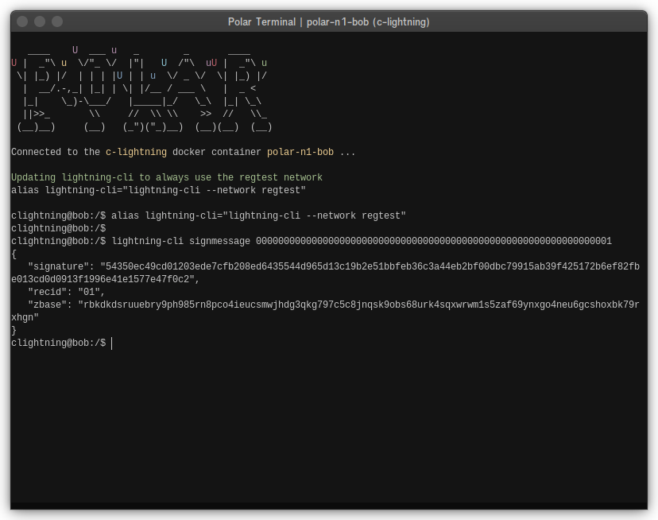
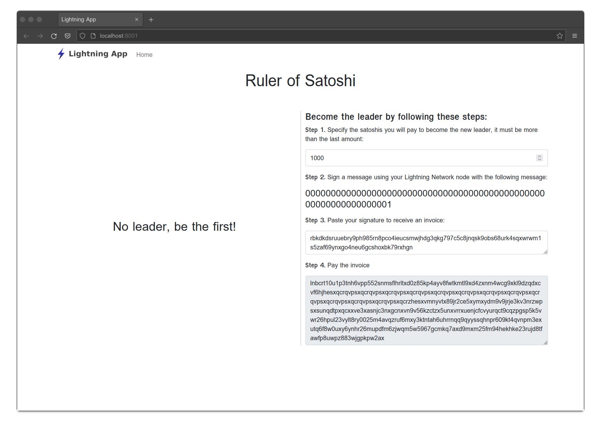
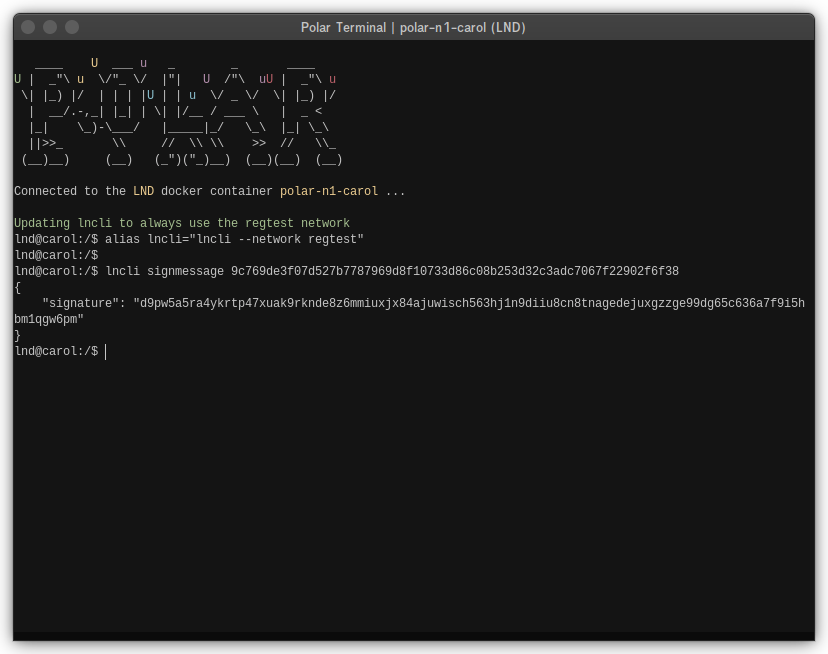

# Working with Invoices

We're now going to turn attention to receiving payments through invoices. You're most likely already familiar with receiving payments via Bitcoin through an address. The Lightning Network handles payments in a different manner. The primary mechanism for receiving payments is through an invoice, also known as a payment request.

For example, Alice runs a web store and Bob wants to buy a t-shirt. He adds the shirt to his cart and goes to check out. At this point, Alice creates an invoice for Bob's purchase. This invoice includes the cost of the shirt, a timeout that Bob needs to complete the transaction within, the hash of a secret value generated by Alice, and Alice's signature denoting that she indeed created the payment request.

Based on the information encoded in the invoice, invoices are typically one-time use and are intended for a specific purpose and amount. Functionally, this means that an invoices tells the sender: who, how much, and within what time frame to send a payment. The invoice is also digitally signed by the recipient. The signature ensures that an invoice can't be forged (Carol can't create an invoice for Alice). The last and possibly most important piece is that the invoice includes the hash of secret information. This hash obscures the secret information that will only get revealed once a payment is made.

Back to our example, when Bob pays Alice she reveals the secret used to generate the hash. Revealing this secret acts as a proof of payment. Alice would only ever reveal the secret if Bob has made payment. Bob can only possess the secret if Alice gives it to him. Bob also has a signed invoice from Alice stating the conditions of the transaction. So once Bob pays Alice and she reveals the secret, Bob has a signed message from Alice and the secret that he can use as proof of payment.

So why all this complexity?

It enables one of the primary purposes of the of the Lightning Network which is trustless payments flow throughout the network. This scheme allows payments to flow through the network even if Bob and Alice aren't directly connected. If you're unsure on how this works or want a refresher, I recommend reading this article on [HTLCs payments](https://medium.com/@peter_r/visualizing-htlcs-and-the-lightning-networks-dirty-little-secret-cb9b5773a0).

For a more thorough walk through of invoices, check out Chapter 15 of _Mastering the Lightning Network_ by Antonopoulos et al.

# Goal of the Application

We're now going to create a self-contained application that relies on the invoice database in our Lightning Network node. We're going to use the Lightning Network and invoices to create a virtual game of [king of the hill](<https://en.wikipedia.org/wiki/King_of_the_Hill_(game)>). To play the game, someone becomes the leader by paying an invoice. Someone else can be the new leader by paying an invoice for more than the last leader. The neat thing is that we'll do this in a way that any leader along the way can cryptographically prove they paid to be the leader. In a sense, this application will act as a simple provenance chain for a "digital right" using invoices.

We'll get into the details of the application as we go, but we'll show what the game looks like from the perspective of Bob, who wants to become the first leader.

If Bob wants to become the leader he digitally signs the message `0000000000000000000000000000000000000000000000000000000000000001` provided by the application using his Lightning Network node.

Note: In Polar we can open a terminal to do this by right-clicking on the node and selecting "Launch Terminal". With c-lightning, you can use the command `signmessage`. It will return a signature in hex and zbase32 formats. To simplify our application we'll use the zbase32 format since LND only interprets signatures in this format.

Now that Bob has his signature, he provides the signature to the application's user interface. The server (run by Alice) creates an invoice using Alice's Lightning Network node. This invoice is specific to Bob. Alice's server returns the invoice to Bob via the user interface.

At this point, Bob can pay the invoice.

Once Bob has paid the invoice he is now the new leader of the game!

If Carol wants to become the new leader, she can sign the message `9c769de3f07d527b7787969d8f10733d86c08b253d32c3adc7067f22902f6f38` using her Lightning Network node.

Note: In Polar, we once again can use the "Launch Terminal" option. With LND, you can also use the CLI command `signmessage`. This will only return a zbase32 format signature, which is the format our application requires.

Carol provides this signature via the user interface and the Alice's server generates an invoice specifically for Carol to become the leader of the game at point `9c769de3f07d527b7787969d8f10733d86c08b253d32c3adc7067f22902f6f38`.

When Carol pays the invoice she will become the new leader!

