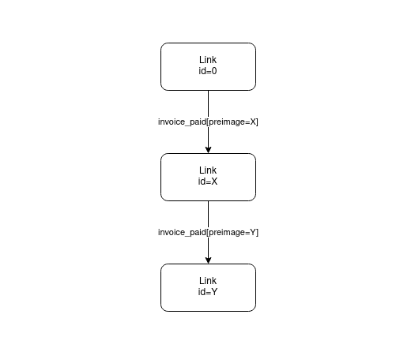

# Creating the `Link` Class

For our application, we can think of the leaders in the game as links in a chain. There is always a link at the end that is "open" for taking over the leadership position. The last closed link in the chain is the current leader of the game.

The `Link` class defines a single link in the chain of ownership. A `Link` can be in one of two states: `unsettled` or `settled`.

When a `Link` is unsettled, it means that no one has take ownership or closed that link. It is still open to the world and anyone can pay an invoice and take ownership. Only the last link in the chain will ever be `unsettled`.

When a `Link` is settled, it means there was an invoice that was paid to close that link. The person that paid the invoice becomes the owner of that link. The last closed link in the chain is considered the current leader of the game.

Take a look at the diagram of game links again.



The preimage of a settled invoice of the _prior_ link becomes the identifier of the next link.

Let's take a look at the `Link` type.

```typescript
export class Link {
  public invoice: Invoice;

  constructor(
    public priorPreimage: string,
    public localSignature: string,
    public minSats: number
  ) {}

  // Methods
}
```

This type has a few properties:

- `priorPreimage` is the identifier of the link.
- `localSignature` is our Lightning Network node's signature of the `priorPreimage`. We'll use this to construct invoices using our `createPreimage` helper function
- `minSats` is the minimum satoshis payment we're willing to accept payment to settle this `Link`. This value will be larger than the last link.

You'll also notice that there is an `invoice` property. This property will be assigned when a invoice when someone pays the `Invoice` that corresponds to this link.

## Exercise: Implement `isSettled`

A `Link` is only considered settled when it has an invoice assigned and that invoice is settled.

Go ahead and implement the `isSettled` getter which should check the `invoice` property to see if it has a value. If it does have a value it should check the invoice to see if it has been settled.

```typescript
public get isSettled(): boolean {
    // Exercise
}
```

When you are finished you can verify you successfully implemented the method with the following command:

```
npm run test:server -- --grep isSettled
```

## Exercise: Implement `next`

Once a `Link` is settled, the `next` property should contain the settling invoice's preimage.

This property should only return a value when a `Link` is settled. When the `Link` is settled it should return the invoice's preimage.

Go ahead and implement the `next` getter.

```typescript
public get next(): string {
    // Exercise
}
```

When you are finished you can verify you successfully implemented the method with the following command:

```
npm run test:server -- --grep next
```
